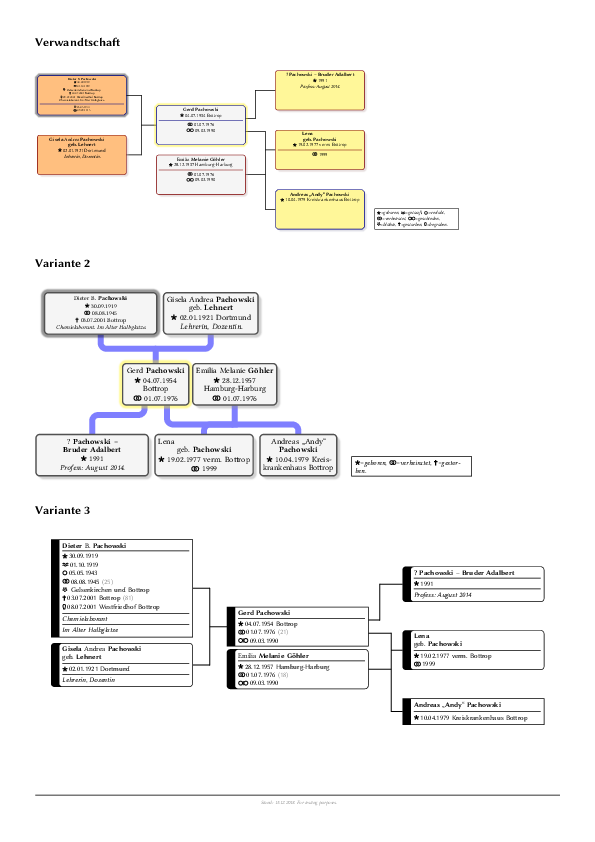
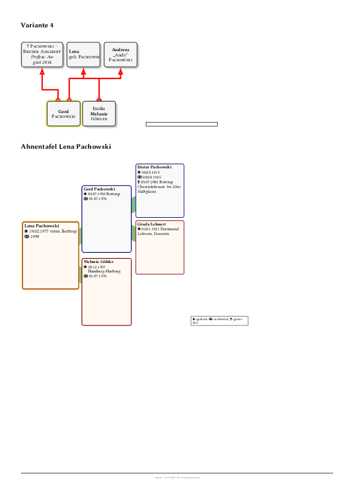

# generations

This tool can help you create beautiful genealogy tree diagrams.

## Toolchain (What does it use?)

* LuaLaTeX
* [genealogytree](https://ctan.org/pkg/genealogytree) package (code at https://github.com/T-F-S/genealogytree)

## Installation (How do I get it?)

With a [**Go**](https://golang.org) environment setup, you can just do this:

    go get -u github.com/jojomi/generations/cmd

Make sure you have **`lualatex`** in your system's `PATH`, on Linux usually via **TeXlive**, on Windows via **MikTeX**.
There is a package you might need to add, specifically `texlive-pictures` for the `genealogytree` code.

## Usage (How do I use it?)

The schema for the **database** entries can be found in [`flat_person.go`](flat_person.go) and [`models.go`](models.go) while the features of a **document config** is in [`cmd/database_config.go`](cmd/database_config.go) (with references to [`render_tree_options.go`](render_tree_options.go) and [`render_person_options.go`](render_person_options.go)).

## Examples (What does it look like?)

You can find an example [**database**](example/database.yml) and a [**document config**](example/config.yml) in the repository.

To render this, you execute:

    generations --config-file example/config.yml
    lualatex test.tex

The result should look like this (when converted to images):

([the real pdf](example/example.pdf))

## FAQ

1. What if I don't like LuaLaTeX?

You can compile with other TeX processors too, but you most likely will have to change the document template.